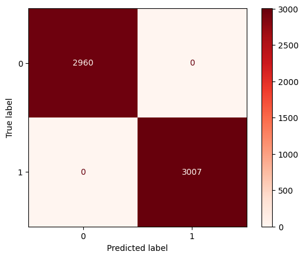
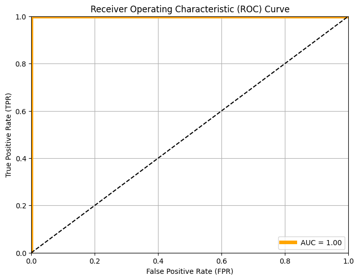

# Signature Verification using Siamese Neural Network

## Overview

This project is an implementation of an smaller model that is inspired from model SigNet given in the paper:
[*Dey, S., Dutta, A., Toledo, J. I., Ghosh, S. K., Lladós, J., & Pal, U. (2017). Signet: Convolutional siamese network for writer independent offline signature verification. arXiv preprint arXiv:1707.02131.*](https://arxiv.org/pdf/1707.02131.pdf) It uses siamese neural network structure with two parallel CNNs to verify if a signature is a forgery or not.

## Table of Contents
+ Overview
+ Table of Contents
+ Datasets
+ Model Architecture
+ Preprocessing
+ Training
+ Evaluation
+ Usage
+ Dependencies

## Datasets

The following datasets have been using in training and evaluation of the model.

### CEDAR

CEDAR signature database contains signatures of 55 signers belonging to various cultural and professional backgrounds. Each of these signers signed 24 genuine signatures 20 minutes apart. Each of the forgers tried to emulate the signatures of 3 persons, 8 times each, to produce 24 forged signatures for each of the genuine signers. Hence the dataset comprise 55 × 24 = 1320 genuine signatures as well as 1320 forged signatures.
<br><br>
Link for [*Dataset*](https://www.kaggle.com/datasets/ishanikathuria/handwritten-signature-datasets)

### BHSig260

The BHSig260 signature dataset contains the signatures of 260 persons, among them 100 were signed in Bengali and 160 are signed in Hindi. Here also, for each of the signers, 24 genuine and 30 forged signatures are available. This results in 100 × 24 = 2400 genuine and 100 × 30 = 3000 forged signatures in Bengali, and 160 × 24 = 3840 genuine and 160×30 = 4800 forged signatures in Hindi.
<br><br>
Link for [*Dataset*](https://www.kaggle.com/datasets/ishanikathuria/handwritten-signature-datasets)

### Custom Dataset

This dataset contains the signature of 124 users both genuine and fraud signature for signature verification. Each person has around 10 Genuine signatures which they made themselves and around 10 Forged signatures someone else made. All the data is extracted from ICDAR 2011 Signature Dataset and CEDAR Signature Verification Dataset.
<br><br>
Link for [*Dataset*](https://www.kaggle.com/datasets/mallapraveen/signature-matching)

### Data used for training

Due to limited computation power I have trimmed the custom dataset down to 40% of its original size and then used it for training, validation and testing purposes. The code to do so is given in `Scripts/data_split.py`

## Model Architecture

### For SigNet
The Model Architecture is as follows:<br><br>
Model_LRN(<br>
  (model_branch): Sequential(<br>
    (0): Conv2d(3, 96, kernel_size=(11, 11), stride=(1, 1))<br>
    (1): ReLU()<br>
    (2): LocalResponseNorm(5, alpha=0.0001, beta=0.75, k=2)<br>
    (3): ReLU()<br>
    (4): MaxPool2d(kernel_size=3, stride=2, padding=0, dilation=1, ceil_mode=False)<br>
    (5): Conv2d(96, 256, kernel_size=(5, 5), stride=(1, 1), padding=(2, 2))<br>
    (6): ReLU()<br>
    (7): LocalResponseNorm(5, alpha=0.0001, beta=0.75, k=2),<br>
    (8): ReLU()<br>
    (9): MaxPool2d(kernel_size=3, stride=2, padding=0, dilation=1, ceil_mode=False)<br>
    (10): Dropout2d(p=0.3, inplace=False)<br>
    (11): Conv2d(256, 384, kernel_size=(3, 3), stride=(1, 1), padding=(1, 1))<br>
    (12): ReLU()<br>
    (13): Conv2d(384, 256, kernel_size=(3, 3), stride=(1, 1), padding=(1, 1))<br>
    (14): ReLU()<br>
    (15): MaxPool2d(kernel_size=3, stride=2, padding=0, dilation=1, ceil_mode=False)<br>
    (16): Dropout2d(p=0.3, inplace=False)<br>
    (17): Flatten(start_dim=1, end_dim=-1)<br>
    (18): Linear(in_features=108800, out_features=1024, bias=True)<br>
    (19): ReLU()<br>
    (20): Dropout1d(p=0.5, inplace=False)<br>
    (21): Linear(in_features=1024, out_features=128, bias=True)<br>
  )<br>
)<br>

Total params: 113,963,840<br>
Trainable params: 113,963,840<br>
Non-trainable params: 0<br>

### For the improved model
The Model Architecture is as follows:<br><br>
Model_BN(<br>
  (model_branch): Sequential(<br>
    (0): Conv2d(3, 96, kernel_size=(11, 11), stride=(1, 1))<br>
    (1): SELU()<br>
    (2): BatchNorm2d(96, eps=1e-05, momentum=0.1, affine=True, track_running_stats=True)<br>
    (3): SELU()<br>
    (4): MaxPool2d(kernel_size=3, stride=2, padding=0, dilation=1, ceil_mode=False)<br>
    (5): Conv2d(96, 256, kernel_size=(5, 5), stride=(1, 1), padding=(2, 2))<br>
    (6): SELU()<br>
    (7): BatchNorm2d(96, eps=1e-05, momentum=0.1, affine=True, track_running_stats=True),<br>
    (8): SELU()<br>
    (9): MaxPool2d(kernel_size=3, stride=2, padding=0, dilation=1, ceil_mode=False)<br>
    (10): Dropout2d(p=0.3, inplace=False)<br>
    (11): Conv2d(256, 384, kernel_size=(3, 3), stride=(1, 1), padding=(1, 1))<br>
    (12): SELU()<br>
    (13): Conv2d(384, 256, kernel_size=(3, 3), stride=(1, 1), padding=(1, 1))<br>
    (14): SELU()<br>
    (15): MaxPool2d(kernel_size=3, stride=2, padding=0, dilation=1, ceil_mode=False)<br>
    (16): Dropout2d(p=0.3, inplace=False)<br>
    (17): Flatten(start_dim=1, end_dim=-1)<br>
    (18): Linear(in_features=108800, out_features=1024, bias=True)<br>
    (19): SELU()<br>
    (20): Dropout1d(p=0.5, inplace=False)<br>
    (21): Linear(in_features=1024, out_features=128, bias=True)<br>
  )<br>
)<br>

Total params: 113,963,840<br>
Trainable params: 113,963,840<br>
Non-trainable params: 0<br>


### For smaller model
The Model Architecture is as follows:<br><br>
Model_BN_s(<br>
  (model_branch): Sequential(<br>
    (0): Conv2d(3, 96, kernel_size=(11, 11), stride=(1, 1))<br>
    (1): SELU()<br>
    (2): BatchNorm2d(96, eps=1e-05, momentum=0.1, affine=True, track_running_stats=True)<br>
    (3): SELU()<br>
    (4): MaxPool2d(kernel_size=3, stride=2, padding=0, dilation=1, ceil_mode=False)<br>
    (5): Conv2d(96, 256, kernel_size=(5, 5), stride=(1, 1), padding=(2, 2))<br>
    (6): SELU()<br>
    (7): BatchNorm2d(96, eps=1e-05, momentum=0.1, affine=True, track_running_stats=True),<br>
    (8): SELU()<br>
    (9): MaxPool2d(kernel_size=3, stride=2, padding=0, dilation=1, ceil_mode=False)<br>
    (10): Dropout2d(p=0.3, inplace=False)<br>
    (11): Conv2d(256, 384, kernel_size=(3, 3), stride=(1, 1), padding=(1, 1))<br>
    (12): SELU()<br>
    (13): Conv2d(384, 256, kernel_size=(3, 3), stride=(1, 1), padding=(1, 1))<br>
    (14): SELU()<br>
    (15): MaxPool2d(kernel_size=3, stride=2, padding=0, dilation=1, ceil_mode=False)<br>
    (16): Conv2d(256, 256, kernel_size=(3, 3), stride=(1, 1), padding=(1, 1))<br>
    (17): SELU()<br>
    (18): MaxPool2d(kernel_size=3, stride=2, padding=0, dilation=1, ceil_mode=False)<br>
    (19): Dropout2d(p=0.3, inplace=False)<br>
    (20): Flatten(start_dim=1, end_dim=-1)<br>
    (21): Linear(in_features=24576, out_features=1024, bias=True)<br>
    (22): SELU()<br>
    (23): Dropout1d(p=0.5, inplace=False)<br>
    (24): Linear(in_features=1024, out_features=128, bias=True)<br>
  )<br>
)<br>

Total params: 28,285,312<br>
Trainable params: 28,285,312<br>
Non-trainable params: 0<br>

## Preprocessing

* The custom class for dataset to be used for this project has been given `utils.py` by the name *SiameseDataset*.
* The transform function that applies to each image is also in `utils.py` and is as follows:
  ```
  transforms.Compose([
      invert,
      ToTensor(),
      Resize((155,220), interpolation=InterpolationMode.BICUBIC),
      Normalize(mean=0.5, std=0.5)
  ])
  ```
  - It inverts the image so that background of each image has 0 values.
  - Converts it to tensor for model training.
  - Resizes image using Bicubic Interpolation to better preserve the detail although you can also use Bilinear Interpolation.
  - Normalizes and standardizes the image.

## Training

* The model has been trained on a trimmed down dataset of 20,884 entries with a validation set of 2984 entries.
* The architecture of models is given in `Models/models.py`
* The training script is given in `Scripts/train_bn_s.py`
* The code for training loop is given in `utils.py`
* Model has been trained using *NAdam optimizer* for 20 epochs with an initial learning rate of 1e-4 and weight decay of 5e-4.
* After 10 epochs the learning rate drops down to 10% of starting learning rate.
* Custom Contrastive Loss function has been used which is availabe in `utils.py`  

## Evaluation

* The model has been tested on testing data by setting a threshold value of 0.5 for the euclidean distance, below it the signatures are authentic, above it there's a forgery. The code for this task is given in `Scripts/testing.py`

* The code for final evaluation is given in `Scripts/evaluation.py` which calculates accuracy, classification report as well as Confusion matrix and ROC curve plot.

### The Confusion matrix 


### ROC Curve


The model achieves 100% performance on the dataset overall.

> The training and testing on other datasets will be done later on.

## Usage

The model can be used for verify offline signatures by simply clicking their picture wherever needed.

## Dependencies

All dependencies can be installed by running the following command in the terminal:

> pip install -r requirements.txt

> Note: The model is available here due to it being over 100 MB, [click here](https://drive.google.com/file/d/1gjx1hrzSbs1s7bcDpr4rg2Dw7EkNxd7H/view?usp=drive_link) if you need it.